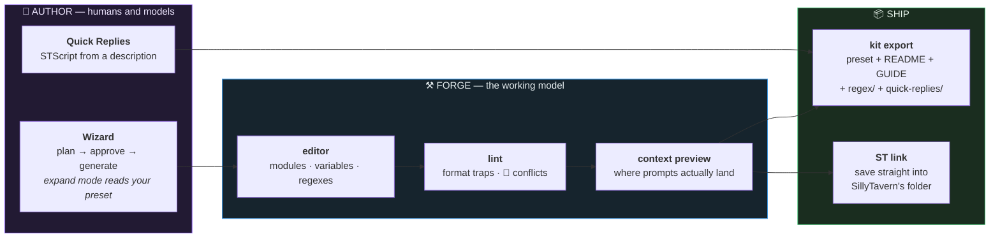

<div align="center">
  
</div>

<div align="center">

# ⚒ PresetForge

**A generative, visual builder for SillyTavern preset kits.**
It treats a preset as a program — **modules, variables, regexes, automations** —
and gives each one an editor, a linter, and an LLM that **never touches the JSON**.

<br/>


**[Plan →](PLAN.md)** · **[SillyTavern →](https://github.com/SillyTavern/SillyTavern)** · **[Run it ↓](#-run)**

</div>

---

> [!NOTE]
> **The LLM never writes preset JSON.** It writes module *content* and structured
> plans; the app owns every identifier, marker, and `prompt_order` entry. That one
> decision deletes the entire "Invalid file" failure class that hand-authored and
> chat-generated presets suffer from — and it is why every export here passes an
> independent validator.

## 🧭 The idea

SillyTavern's popular presets stopped being settings files years ago. NemoEngine
11.5 is **451 prompt modules and 91 regex scripts**; a preset like that is a small
program, edited today through a drag-and-drop list or raw JSON. PresetForge is the
missing IDE: import anything, see what the model will actually receive, change it
with confidence, ship it as a kit.



## What it does

| | capability | the part that matters |
|:--:|---|---|
| **1** | **Workspace** | Preset library with slots; imports (file or 🌐 URL) never overwrite work. 🕒 snapshots diff and restore. |
| **2** | **Context preview** | Structural simulation of the final prompt stack — markers expanded, In-Chat injections spliced at true depth, same-depth ordering matched to ST's *code*, not its docs. |
| **3** | **Variable manager** | Rename a `{{setvar}}` across 90 modules, jump to usages IDE-style, one-click fix dangling reads. |
| **4** | **Card-aware advisor** | Load a character card; 🎯 recommends which modules to enable for *that* character, with reasons. |
| **5** | **Regex + QR kits** | Author ST regex scripts (live test box) and STScript Quick Replies (LALib-aware generation), shipped inside the preset or as kit files. |
| **6** | **Text Completion wing** | 🧩 instruct / context / sysprompt template editor, schema-verified against ST's shipped templates. |

> [!WARNING]
> **The preview is structural, not byte-identical.** It promises correct *placement*
> — which is the thing everyone gets wrong. Fun fact from building it: SillyTavern's
> own documentation describes same-depth injection role order incorrectly; the
> preview follows `populationInjectionPrompts` in the source instead. Trust code
> over docs. Always.

## 🧰 Run

```
npm install
npm run dev        # http://localhost:5299
```

LLM features (wizard, advisor, refine, QR generation) need a provider in ⚙ —
prebuilt entries for **LM Studio · OpenRouter · OpenAI · Anthropic**; the model
dropdown fetches live from the server, which doubles as your connection test.
Keys never leave the browser.

```
npx esbuild tests/roundtrip.ts --bundle --format=esm --platform=node \
  --outfile=/tmp/rt.mjs && node /tmp/rt.mjs [path-to-preset.json]
```

The round-trip suite asserts semantic identity on a real 451-module preset —
params, prompts, order, per-character entries — and exits nonzero on drift.

## 📁 Layout

```
preset-forge/
├── src/lib/
│   ├── preset.ts        normalize/export -- the only code allowed to touch JSON shape
│   ├── lint.ts          the trap detector; rule parity with the Python validator
│   ├── assemble.ts      context preview -- placement per ST source, not docs
│   ├── macros.ts        setvar/getvar graph, rename machinery
│   ├── regex.ts         ST regex scripts (extensions.regex_scripts)
│   ├── quickReplies.ts  QR sets + STScript closure linting
│   ├── kit.ts           preset + README + MODULE_GUIDE + kit folders
│   ├── stLink.ts        FS-Access bridge into SillyTavern's own folder
│   └── gen.ts           every LLM prompt in the app lives here
├── src/components/      one file per pane/modal, no framework beyond React
├── tests/               round-trip + feature suites against real presets
└── PLAN.md              phases, verify gates, the parking lot
```

---

<div align="center">

*Verified against SillyTavern 1.18's source, stress-tested on the biggest preset
in the wild, and reviewed by eleven adversarial agents before v0.2 — because a
tool that edits 451-module programs doesn't get to guess.*

**[⚒ Plan](PLAN.md)** · **[🧪 Tests](tests/)** · **[🐙 SillyTavern](https://github.com/SillyTavern/SillyTavern)**

</div>
