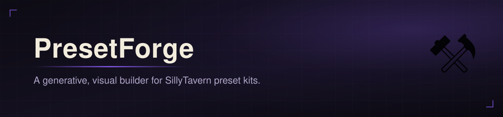
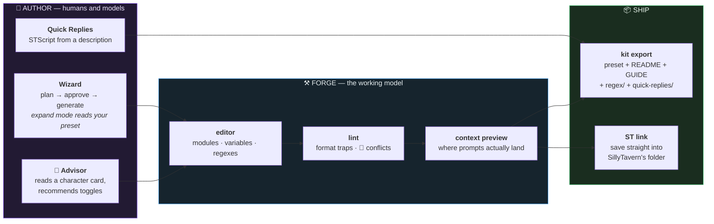

<div align="center">
  
</div>

<div align="center">

# ⚒ PresetForge

**A generative, visual builder for SillyTavern preset kits.**
It treats a preset as a program — **modules, variables, regexes, automations** —
and gives each one an editor, a linter, and an LLM that **never touches the JSON**.

<br/>


**[Plan →](PLAN.md)** · **[SillyTavern →](https://github.com/SillyTavern/SillyTavern)** · **[Run it ↓](#-run)**

</div>

---

> [!NOTE]
> **The LLM never writes preset JSON.** It writes module *content* and structured
> plans; the app owns every identifier, marker, and `prompt_order` entry. That one
> decision deletes the entire "Invalid file" failure class that hand-authored and
> chat-generated presets suffer from — and it is why every export here passes an
> independent validator.

## 🧭 The idea

SillyTavern's popular presets stopped being settings files years ago. NemoEngine
11.5 is **451 prompt modules and 91 regex scripts**; Chimera is 90 modules with
30 in-chat injections; whole browser extensions exist just to *navigate* presets
this size. A preset like that is a small program — with state, load order,
mutually-exclusive branches, output post-processing, and automations riding
alongside. It is edited today through a drag-and-drop list or raw JSON.

PresetForge is the missing IDE: import anything, see what the model will
*actually* receive, change it with confidence, generate the boring parts, and
ship the result as a distribution-grade kit.



---

## 🗂 The workspace

A preset library, not a single file. Slots switch instantly from the toolbar;
imports — from disk **or straight from a URL** (🌐, GitHub raw links work) —
always open a *new* slot, so checking out someone else's preset can never
overwrite an hour of your work. Duplicate a preset before surgery, delete the
experiments after.

**🕒 Snapshots** back every slot: a ring of five per preset, taken automatically
before wizard runs and restores, or manually whenever. The diff view shows
exactly what changed between then and now — modules added/removed/edited,
toggles flipped, sampler params moved, order rearranged — and restore keeps an
escape-hatch snapshot of the state you're leaving.

At NemoEngine scale the outline stays navigable: divider modules become
**collapsible sections** (both the `━━━` empty-divider convention and Nemo's
`=== Banner ===` style are detected), collapse-all turns 451 rows into a
16-line table of contents, and **Ctrl+K** fuzzy-jumps to any module by name.
Rows are memoized — a toggle re-renders one row, not four hundred.

**📦 Module library**: hit ☆ on any module to bank it as a reusable block, then
insert it into any other preset with a fresh identifier. Your best genre
toggles, CoT blocks, and stances stop being copy-paste jobs.

## 🤖 Authoring with models

Every LLM feature speaks to **LM Studio, OpenRouter, OpenAI, or Anthropic** —
prebuilt service entries where the API key is the only thing you type. The
model dropdown fetches live from the server's `/models` endpoint, which doubles
as the connection test: models appearing *is* the proof it's wired.

- **✨ Wizard** — describe the preset; the model returns a module *plan* (names,
  categories, placements, defaults) which you prune before any content is
  generated. Generation runs three requests in parallel and applies
  **atomically** — a failure at module 9 of 12 leaves your preset untouched.
  **Expand mode** points the wizard at an existing preset instead: it reads the
  current module names, plans only complements, and leaves your Main Prompt and
  samplers alone.
- **🎯 Advisor** — load a character card (V2/V3 JSON, or a card PNG — the
  embedded `chara`/`ccv3` chunk is parsed in-browser) and the advisor reads it
  against your module list, recommending per-module enable/disable **with
  reasons**, applied selectively in one click. NemoGuides' idea, moved to
  authoring time.
- **Refine** — every module editor carries an instruction box: "make it half as
  long and more forceful" returns a proposal you accept or discard. Proposals
  are keyed to the module, so switching selection mid-flight can never write
  the wrong module.
- **⚡ QR generation** — see below; the STScript primer is LALib-aware.

## 🔬 The linter and the preview

The format knowledge comes from SillyTavern's *source*, not its docs or
community lore — and that distinction has teeth. Things the lint catches that
circulate wrongly in guides:

- presets wrapped in `{"version","type","data"}` (imports as a dead preset)
- flat `prompt_order` lists (silently ignored by ST — the real shape nests
  under `character_id`, and Chat Completion reads **100001**)
- `injection_depth` set on Relative-position prompts (**depth only applies
  In-Chat** — entire "depth strategies" in popular guides do nothing)
- `{{getvar::name::}}` — the trailing `::` breaks the lookup
- deprecated keys (`claude_use_sysprompt` → `use_sysprompt`), proxy keys that
  trigger import warnings, unreachable modules, duplicate order rows, enabled
  In-Chat prompts with Chat History disabled (they'd never be sent)

The **context preview** renders the assembled stack against a sample scene or
your loaded card: relative prompts in order, markers expanded, In-Chat prompts
spliced into the chat at their true depth — with same-depth ordering matched to
`populationInjectionPrompts` in ST's source. Click any block to jump to its
module.

> [!WARNING]
> **The preview is structural, not byte-identical.** It promises correct
> *placement* — which is the thing everyone gets wrong. Fun fact from building
> it: SillyTavern's own documentation describes same-depth injection role order
> incorrectly; the preview follows the source instead. Trust code over docs.

## 🧵 Variables

`{{setvar}}`/`{{getvar}}` networks get IDE treatment: the Vars tab maps every
definition and read across the preset, **renames a variable through all 90
modules** in one collision-checked operation, jumps to any usage with the macro
literally selected in the editor, and offers a one-click redirect for dangling
reads pointing at variables nothing defines.

## 🧪 Regex kit

The big engines ship regex scripts because presets shape the input but regexes
shape the *output* — em-dash removal, format unification, dialogue styling.
PresetForge authors them natively: placement flags (AI output / user input /
reasoning / …), display-vs-prompt targeting, per-script validation, and a
**live test box** that runs your find/replace as you type. Scripts store inside
the preset at `extensions.regex_scripts` — the modern ST mechanism, gated
behind ST's own per-preset allow prompt — or export as standalone files for
older setups.

## ⚡ Quick Replies and STScript

Preset kits ship automations too. The QR editor builds `version: 2` Quick Reply
sets (schema straight from ST's `QuickReplySet.toJSON`), lints STScript closure
balance inline, and **generates scripts from a description** — "a d20
skill-check button, a rewind button, a scene summarizer" — against a primer of
core STScript. Toggle **LALib mode** (on by default) and the generator may use
LenAnderson's 98-command library: `/=` expressions, `/foreach`/`/switch`
control flow, list and dict ops, swipe and message surgery, even `/qr-add`.

## 🧩 Text Completion wing

For the local-model crowd: an instruct / context / system-prompt template
editor with schema-driven forms verified against ST's shipped templates
(ChatML, Llama-3, …). Import any template JSON — the kind is auto-detected —
edit every sequence and flag, export it back.

## 📦 Shipping

- **🧰 Kit export** writes a distribution folder in one click: the preset,
  a generated `README.md` (install steps including the regex allow-gate,
  defaults, exclusion groups, sampler table), a `MODULE_GUIDE.md` documenting
  every module grouped by section, standalone `regex/` scripts, and
  `quick-replies/` sets. Run against NemoEngine it produces 94 files and
  documents 422 modules.
- **🔗 ST link** goes one better than export: pick your
  `SillyTavern/data/<user>/OpenAI Settings` folder once (the handle persists),
  then **Save to ST** writes directly into SillyTavern and **Open from ST**
  imports from the live folder. The export→import dance is gone.
- **📖 README generator** builds the in-preset documentation module — the
  mega-preset convention — from the actual module tree, zero LLM required.
- **🔗 exclusion groups**: name variants `🔗 POV: First Person` /
  `🔗 POV: Third Person` and enabling one auto-disables its siblings; imports
  that arrive with conflicting groups enabled get flagged by lint instead.

## 📏 The verification story

This tool edits 451-module programs, so it doesn't get to guess:

| | claim | receipt |
|:--:|---|---|
| **1** | Round-trips are lossless | Test suite asserts semantic identity — params, prompts, order, per-character entries — on real NemoEngine and Chimera files; exits nonzero on drift |
| **2** | The format model is true | Every schema fact verified against ST 1.18 `release` source; the sibling `creating-sillytavern-presets` skill shares the same rule set |
| **3** | The code was hunted | Eleven adversarial review agents before v0.2: 15 findings reported, 15 fixed — including the preview's injection order being wrong on both axes |
| **4** | It holds at scale | 451-module import in ~5ms, ~41ms per edit frame at 453 modules, sections collapse the wall to a table of contents |

## 🧰 Run

```
npm install
npm run dev        # http://localhost:5299
```

Everything is local-first: presets, the module library, TC templates, and QR
sets persist in the browser; API keys never leave it. No backend, no build step
beyond Vite.

```
npx esbuild tests/roundtrip.ts --bundle --format=esm --platform=node \
  --outfile=/tmp/rt.mjs && node /tmp/rt.mjs [path-to-preset.json]
```

## 🙏 Lineage

This tool stands on other people's work, and says so:

- **[cha1latte's sillytavern-preset-creator](https://github.com/cha1latte/sillytavern-preset-creator)** —
  the seed. Its three-part guide to AI-authored presets shaped this app's module
  patterns, tier thinking, and defaults strategy — and chasing its format claims
  down against SillyTavern's actual source became the founding discipline here:
  *verify everything, trust code over lore.* This project exists because that
  guide asked the right question first.
- **[NemoVonNirgend](https://github.com/NemoVonNirgend/NemoEngine)** — NemoEngine
  is the stress-test fixture and the proof that presets became programs;
  NemoPresetExt's conventions inform the section system, and NemoGuides'
  Prompt Advisor inspired 🎯.
- **[LenAnderson](https://github.com/LenAnderson/SillyTavern-LALib)** — LALib's
  98 commands power the QR generator's richest mode. H A I L Lenny.
- **[Nativu5's STPresetEditor](https://github.com/Nativu5/STPresetEditor)** —
  prior art for visual preset editing; its variable find-usages set the bar the
  Vars tab aims at.
- **[The SillyTavern team](https://github.com/SillyTavern/SillyTavern)** — the
  platform all of this orbits.

## 📁 Layout

```
preset-forge/
├── src/lib/
│   ├── preset.ts        normalize/export -- the only code allowed to touch JSON shape
│   ├── lint.ts          the trap detector; rule parity with the Python validator
│   ├── assemble.ts      context preview -- placement per ST source, not docs
│   ├── macros.ts        setvar/getvar graph, rename machinery
│   ├── groups.ts        🔗 exclusion groups + section-header detection
│   ├── regex.ts         ST regex scripts (extensions.regex_scripts)
│   ├── quickReplies.ts  QR sets + STScript closure linting
│   ├── tcTemplates.ts   instruct/context/sysprompt schemas
│   ├── snapshots.ts     per-preset ring buffer + structural diff
│   ├── kit.ts           preset + README + MODULE_GUIDE + kit folders
│   ├── stLink.ts        FS-Access bridge into SillyTavern's own folder
│   ├── cards.ts         V2/V3 card JSON + PNG chara-chunk parsing
│   └── gen.ts           every LLM prompt in the app lives here
├── src/components/      one file per pane/modal, no framework beyond React
├── tests/               round-trip + feature + kit suites against real presets
└── PLAN.md              phases, verify gates, the parking lot
```

---

<div align="center">

*Verified against SillyTavern 1.18's source, stress-tested on the biggest preset
in the wild, and reviewed by eleven adversarial agents before v0.2 — because a
tool that edits 451-module programs doesn't get to guess.*

**[⚒ Plan](PLAN.md)** · **[🧪 Tests](tests/)** · **[🐙 SillyTavern](https://github.com/SillyTavern/SillyTavern)**

</div>
